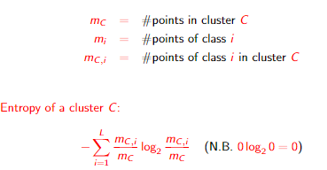

# Clustering

## General definition

Given a __set of points__ belonging to some __space__, with a notion of __distance__ between points, __clustering__ aims at grouping the points into a number of subsets (___clusters___) such that

* points in the same cluster are “close” to one another
* points in different clusters are “distant” from one another

THe distance captures a notion of similarity: close points are similar, distant points are dissimilar

A __clustering problem__ is usually defined by requiring that clusters optimize a given __objective function__, and/or satisfy certain __properties__. Numerous clustering problems have been defined, studied and employed in applications over the years.

## Metric Space

Typically, the input of a clustering problem consists of a set of points from a __metric space__

### Definition

A __metric space__ is an ordered pair (M, d) where M is a set and d(.) is a metric on M, i.e., a function

    d: M * M->R

such that for every x, y, z in M the following rules holds

* d(x, y) >= 0
* d(x, y) = 0 iff x = y
* d(x, y) = d(y, x) (symmetry)
* d(x, z)<=d(x, y) + d(y, z) (triangle inequality)

## Distance functions

### Euclidean distances


### Jaccard distance

Used when points are sets. Let S and T be two sets over the same ground set of elements. The Jaccard distance between S and T is defined as


Note that the distance ranges in [0,1], and it is 0 iff S = T and 1 iff S and T are disjoint. The fraction in the Jaccard distance is referred to as the _Jaccard similarity_ of the two sets

### Cosine (or angular) distance


__Remark__. The cosine distance is often used in information retrieval to assess similarity documents. Consider an alphabet of _n_ words. A document X over the alphabet can be represented as an _n_-vector, where _xi_ is the number of occurrences in X of the _i_-th word of the alphabet

* For non-negative coordinates it takes values in [0,π/2], while for arbitrary coordinates the range is [0,π]. Dividing by π/2 (or π) the range becomes [0,1]
* In order to satisfy the second property of distance functions for metric spaces, scalar multiplesof a vector must be regarded as the same vector

### Edit distance

Used for strings. Given two strings X and Y, their edit distance is the __minimum number of deletion and insertion__ that must be applied to transform X in Y

It is immediate to show that in all cases the edit distance is

|X|+|Y|-2|LCS(X, Y)|

### Hamming distance

Used when points are vectors over some _n_-dimensional space. Most commonly, it is used for binary vectors. The Hamming distance between two vectors is __the number of coordinates in which they differ__.

## Curse of dimensionality

Random points in high-dimensional metric space tend to be

* sparse
* almost equally distant from one another
* almost orthogonal (as vectors) to one another

As a consequence, in high dimensions distance functions may lose effectiveness in assessing similarity/dissimilarity. However, this holds in particular when points are random, and it might be less a problem in some real-world datasets.

As an example, consider a set S of N random points in [0,1]^t, where for each point the i-th coordinate is a random number in [0,1] drawn with uniform probability indipendently of the other coordinates and of the other points.


## Types of clustering

Given a set of points in a metric space, hence a distance between points, a clustering problem often specifies and __objective function__ to optimize. The objective function also allows comparing different solutions.

Objective functions can be categorized based on wether or not

* a target number _k_ of clusters is given in input
* for each cluster a _center_ must be identified

  When centers are required, the value of the objective function depends on the selected centers. Cluster centers must belong to the underlying metric space but, sometimes, they are costrained to belong to the input set.
* _Disjoint clusters_ are sought

### Center-based clustering

Let P be a set of N points in a metric space (M, d), and _k_ be the target number of clusters, 1 <= _k_ <= N. We define a ___k_-clustering of P__ as a tuple C = (C1,..., C _k_;c1,..., c _k_) where


Observe that the above definition requires the center to belong to the clusters, hence to the pointset. Whenever appropriate, we will discuss the case when the center can be chose more freely from the metric space.


* All aforementioned problems (k-center, k-means, k-median) are __NP-hard__. Hence, in general it is impractical to search for optimal solutions.
* There are severa efficient approximation algorithms that in practice return good-quality solutions. However, dealing efficiently with large inputs is still a challenge.
* K-center and k-median belong to the family of __facility-location-problems__. In these problems, a set F of candidate facilities and a set C of clients are given and the objective is to find a subset of at most _k_ candidate facilities to open, and an assignment of clients to them, so to minimize the maximum of average distance between a client and its assigned facilities. In our formulation, each input point represents both a facility and a client. Numerous variants of these problems have been studied in the literature.
* K-means objective is also referred to as __Sum of Squared Errors (SSE)__

### Partitioning primitive

Let P be a pointset and S subset of P a set of _k_ selected centers. For all previously defined clustering problems, the best _k_-clustering around these centers is the one where each ci belongs to a distinct cluster and each other point is assigned to the cluster of the closest ci (ties broken arbitrarily)


## k-center clustering

### Farthest-First Traversal: algorithm


* K-center clustering provides a strong guarantee on how close each point is to the center of its cluster.
* However, gor noisy pointsets (e.g. pointsets with outliers) the clustering which optimizes the _k_-center objective may obfuscate some “natural” clustering inherent in the data
* For any fixed ε > 0 it is NP-hard to compute a _k_-clustering C_alg with

  

  hence, the Farthest-First Traversal is likely to provide almost the best approximation guarantee obtainable in polynomial time

### k-center clustering for big data

How can we compute a “good” k-center clustering of a pointset P that is too large for a single machine?

We employ a __coreset-based approach__:

1. Extract from P a small T (coreset) of representatives
2. Compute within T the set S of _k_ cluster centers
3. Compute the final clustering around the center of S

__Observations__:

* The coreset-based approach is effective when step 1 and 3 can be performed efficiently, and the coreset T contains a good set of centers
* Coreset are used to confine computations which are too expensive to run on the whole input on small instances
* A coreset needs not to be a simple subset of the input

### MapReduce-Farthest-First Traversal

Let P be a set of N points (N large) from a metric space (M, d), and let _k_ > 1 be an integer. The following MapReduce algorithm computes a good _k_-center clustering.

1. Partition P arbitrarily in _l_ subsets of equal size and execute the Farthest-First Traversal algorithm on each subset separately to identify a set T_i of _k_ centers.
2. Gather the coreset T = union of all T_i and run using a single reducer, the Farthest-First Traversal algorithm on T to identify S = {c1,..., c _k_} of _k_ centers
3. Execute Partition(P, S)

__Observation__:

Note that in rounds 1 and 2 the Farthest-First traversal algorithm is used to determine only centers and not complete clusterings.

#### Analysis of MR-Farthest-First Traversal

Assume _k_=o(N). By settings _l_ = (N/_k_)^1/2, it is easy to see that the 3-round MR-Farthest-First traversal algorithm uses


#### Observations on MR-Farthest-First Traversal

* The sequential Farthest-First Traversal algorithm is used both to extract the coreset and to compute the final set of centers. It provides a good coreset since it ensures that any point not in the coreset be well represented by some coreset point.
* The main feature of MR-Farthest-First Traversal is that while only small subsets of the input are processed at once, and many of them in parallel, the final approximation is not too far from the best achievable one.
* By selecting _k'_ > _k_ centers from each subset Pi in round 1, the quality of the final clustering improves. In fact, it can be shown that when P satisfy certain properties and _k'_ is sufficiently large, MR-Farthest-First Traversal returns a (2+ε)-approximation for any constant ε > 0, still using sublinear local space and linear aggregate space.

## k-means clustering

### General observations on k-means clustering

* In essence, __k-means clustering aims at minimizing cluster variance__. It is typically used in Euclidean spaces and works well for discovering ball-shaped clusters.
* Because of the quadratic dependence on distances, __k-means clustering is rather sensitive to outliers__. However, the fact that the objective function sums all distances, makes it more robust than the k-center objective to noise and outliers.
* Some __established algorithms for k-means clustering perform well in practice__ although only recently a rigorous assessment of their performance-accurancy tradeoff has been carried out.

### Propererties of Euclidean spaces


__Observation:__ The lemma implies that when seeking a _k_-clustering for points in R^D which minimizes the __kmeans__ objective, the best center to select for each cluster is its centroid (assuming that centers need not necessarily belong to the input pointset)

### Lloyd's algorithm

* Also Known as __k-means algorithm__
* It focuses on Euclidean spaces and does not require cluster centers to belong to the input pointset
* It relates to generalization of the Expectation-Maximization algorithm


#### Theorem

The Lloyd's algorithm always terminates

#### Observations on Lloyd's algorithms

* Lloyd's algorithm may be trapped into a local optimum whose value of the objective function can be much larger than the optimal value. Hence, no guarantee can be proved on its accuracy. Consider the following example and suppose that _k_ = 3.

  

  If initially one center falls among the points on the left side, and two centers fall among the points on the right side, it is impossible that one center moves from right to left, hence the two obvious clusters on the left will be considered as just one cluster.
* While the algorithm surely terminates, the number of iterations can be exponential in the input size
* Besides the trivial k^N __upper bound__ on the number of iterations, more sophisticated studies proved an __O(N^(kD)) upper bound__ which is improved upone the trivial one, in scenarios where k and D are small
* Some recent studies proved also a 2^(Ω(sqrt(N))) __lower bound__ on the number of iterations in the worst case
* Despite the not so promising theoretical results, empirical studies show that, in practice, __the algorithm requires much less than _N_ iterations__, and, __if properly seeded it features guaranteed accurancy__
* In order to improve performance, without sacrificing the quality of the solution too much, one could stop the algorithm earlier, e.g., when the value of the objective function decreases by a small additive factor.

### Effective initialization

The quality of the solution and the speed of convergence of Lloyd's algorithm depend considerably from the choice of the initial set of centers

## k-means++

Let _P_ be a set of _N_ points in R^D, and let k>1 be an integer

__Algorithm k-means++ computes a initial set _S_ of _k_ centers for _P_ using the following procedure (note that _S_ subset of _P_):


__Observation__:

Although k-means++ already provides a good set of centers for the k-means problem it can be used to provide the initialization for Lloyd's algorithm, whose iterations can only improve the initial solution

### k-means clustering in MapReduce

* In practice, one could initialize the centers using k-means++ and then run a few rounds of Lloyd's algorithm, until the quality of the clustering shows little improvement
* In order to reduce the number of iterations of k-means++, hence the number of MapReduce rounds, a parallel variant of k-means++ has been proposed: in this variant a coreset of > k centers is selected in a few iterations and then k centers are extracted from the coreset using a weighted version of k-means++ or of any other algorithm for k-means clustering.

## k-median clustering

### Partitioning Around Medoids (PAM) algorithm

* Based on the local search optimization strategy
* Unlike the k-means algorithm, cluster centers belong to the input pointset and are referred as __medoids__


### Pam algorithm: analysis


### Observations on k-median clustering

* k-median is less sensitive to outliers than k-center and k-means since all distances are taken into account
* the PAM algorithm works for any metric space and features provable performance and approximation guarantees. However, it is very slow in practive since in each iteration up to (_N-k_)\*_k_ swaps may need to be checked, and for each swap a new clustering must be computed.
* a faster alternative is an __adaption of the k-means algorithm__: in each iteration of the main while loop, and for each current cluster C_i the new center (__medoid__) will be the point of C_i which minimizes the sum of the distances to all other points, instead of the centroid used by k-means. This algorithm appears faster and still very accurate in practice

### How to pick the right value for k

* Sometimes, the application provides a target value for _k_
* If such a target value of _k_ is known:
  * Find a _k_-clusterings with geometrically larger values of _k_ and stop at _k = x_ if the value of the objective function for _k = x_ does not improve "too much" with respect to _k = x/2_
  * Refine search of _k_ in [x/2,x]

### Weighted k-median clustering

One can define the following, more general, __weighted variant of the k-median clustering problem__.

Let _P_ be a set of _N_ points from a metric space (M,d), and let _k_ > 1 be an integer. Suppose that for each p in _P_ an integer weight w(p) > 0 is also given. We want to compute the _k_-clustering C = (C_1,C_2,...,C_k;c_1,c_2,...,c_k) of _P_ which minimize the following objective function


that is, the average weighted distance of a point from its cluster center.

By considering each point of _P_ as representing w(p) identical copies of p, one can easily devise a __weighted version of the PAM algorithm__ to solve Weighted k-median clustering with the same approximation guarantees.

### k-median clustering in MapReduce: MR-PAM

__The PAM algorithm is impractical for large datasets__.

The following coreset-based MapReduce algorithm (MR-PAM) is more suitable for the big data scenario.

* __Round 1__: Partition _P_ is arbitrarily in _l_ subsets of equal size P_1,P_2,...,P_l and execute the PAM algorithm independently on each P_i. For 1<= i <= l let T_i be the set of _k_ centers of the clustering computed on P_i and, for each p in T_i, let w(p) be the number of points in the cluster centered at p
* __Round 2__: Gather the coreset T = Union of all T_i of _l\*k_ points, together with their weights. Using a simple reducer, run the weighted version of PAM on T to identify a set S = {c_1,c_2,...,c_k} of _k_ centers
* __Round 3__: Run Partition(P,S) to return final clustering

### MR-PAM: analysis

Assume _k = o(N)_. By setting _l = sqrt(N/k)_, it is easy to see that the 3-round MR-PAM algorithm requires

* __Local Space__: _M_L = O(sqrt(N\*k)) = o(N)_
* __Aggregate Space__: _M_A = O(N)_

MR-PAM algorithm is claimed to be a __15-approximation algorithm__. In fact, by using an α-approximation algorithm instead of (weighted) PAM in Rounds 1 and 2, they claim that the final approximation factor is 3α.

In order to ensure polynomial time for the reduce functions, in Round 1 and 2 one should run the version of PAM that stops whenever the improvement in the objective function is below a fixed threshold.

## Cluster Evaluation

### Goals

* __Clustering tendency__: assessment wether the data contain meaningful clusters, namely clusters that are unlikely to occur in a random data.
* __Unsupervided evaluation__: assessment of the quality of a clustering _without reference to external information_
* __Supervised evaluation__: assessment of the quality of a clustering _with reference to external information_

### Clustering tendency: Hopkins statistics

Let _P_ be a dataset of _N_ points in some metric space (M,d).

The __Hopkins statistic__ measures to what extent the points of _P_ can be regarded as taken randomly from _M_. For some fixed _t << N_ (typically _t < 0.1\*N_) let:


* __H(P) ~ 1: P__ is likely to have a clustering structure
* __H(P) ~ 0.5: P__ is likely to be a random set
* __H(P) << 0.5:__ the points of __P__ are likely to be well spaced.

### Unsupervised evaluation

* In the case of k-center, k-means, and k-median, the value of the objective function can be employed to assess the quality of a clustering or the relative quality of two clusterings.
* For a clustering of a more general type, one could compare the __cohesion__ within clusters against the __separation__ between clusters:
  * __Cohesion__: average distance between two points in the same clusters, where the average is taken over all such pairs of points
  * __Separation__: average distance between two points in different clusters, where the average is taken over all such pairs of points

  The larger the gap between cohesion and separation, the better the quality of the clustering

#### Silhouette coefficient

Let _C_ be a clustering of a pointset _P_.

For a point p in _P_ belonging to some cluster C in _C_


The quality of _C_ can be assessed through the


_C is a "good" clustering if __s_C~1__

### Unsupervised evaluation for big data

* Computing cohesion and separation or the average silhouette coefficient exactly requires computing Θ(|_P_|^2) inter-point distances, which becomes prohibitive for very large inputs
* Cohesion and separation can be approximated by sampling pairs of intra-cluster and inter-cluster points, respectively
* The __average silhouette coefficient__ can be approximated in several ways:
  * First a suitable center is computed for each cluster C. Then, for each p in C, the value b_p is approximated with the average distance between p and the points of the cluster C'/C whose center is closest to p
  * For each p in a cluster C, the value b_p is approximated with the minimum, over all clusters C'!=C, of the average distance between p and a random sample of the points in C'. Also, a_p can be approximated with the average distance between p and a random sample of the points in C

### Supervised evaluation: entropy

Consider a clustering _C_ of a pointset _P_. Suppose that each point _p in P_ is associated with a class label out of a domain of _L_ class labels.

For each cluster C in _C_ and class _i_ let

  

It measures the impurity of C, ranging from 0 to log_2 _L_


It measures how evenly the points of class _i_ are spread among clusters, ranging from 0 to log_2 _K_, where _K_ is the number of clusters.

It is defined also when points belong to multiple classes

When the number _k_ of clusters and the number _L_ of labels are small, entropies van be determined efficiently even for very large pointsets _P_.

If _k\*L = o(N)_, with _N_ = |_P_| use the following MapReduce algorithm:

1. __Round 1__: Partition _P_ arbitrarily in sqrt(_N_) subsets of equal size _P_1, P_2,...,P_sqrt(N)_. Within each P_j compute, for each class _i_ and cluster C, the number m_{C,i}(j) of points of class _i_ in C intersected P_j
2. __Round 2__: For each class i and cluster C, gather all m_{C,i}(j)'s and compute their sum
3. __Round 3__: Gather all m_{C,i}'s and compute the desired entropies.

The algorithm requires _O(sqrt(N)+k\*L)_ local space and linear aggregate space.

## Hierarchical clustering

* Produces a hierarchy of nested clusterings of decreasing cardinalities
* No need to fix the number of clusters a priori or to choose cluster centers.
* Two alternative high-level strategies:
  * Agglomerate: Starts with each input point in a separate cluster and progressively merges suitably selected pairs of clusters. It is the most common strategy.
  * Divisive: Starts with one cluster containing all points and progressively splits a cluster into two.

### General Agglomerative strategy

Let _P_ be a set of _N_ points in a metric space (M,d).

```pseudo
Make each point as a distinct singleton cluster
while (!stopping-condition) do
  merge the two closest clusters
return the current set of clusters
```

__Observation__:

* In order to instantiate the algorithm one needs to decide when to stop and which pair of clusters to merge at each iteration
* The number of clusters decreases by 1 at each iteration
* Instead of returning the clustering resulting after the last iteration, one may return the dendogram, i.e., the tree/forest defined by all clusters created at the various iterations

### Merging criterion

How do we measure the distance between two clusters C_1,C_2 so to be able to identify the "two closest clusters" at each iteration?


### Stopping condition

Depending on the application, the merging process can be stopped using one of the following conditions

* A desired number _K_ of clusters obtained
* The distance between the next pair of clusters to be merged exceeds a fixed cluster threshold _t_
* The clustering resulting after the next merge would violate some specific condition on the density or cohesion of the clusters


### Time complexity

Consider the execution of the hierarchical clustering strategy for a set _P_ of _N_ points.

At each iteration, maintain with each point the ID of the cluster it belongs to (Θ(_N_))

#### Straightforward implementation

* In each iteration, search for the pair of closest clusters by computing the distances between all pairs of points
* Θ(_N_^2) time per iteration, hence Θ(_N_^3) overall time, if full hierarchy is sought
* Θ(_N_) space, if distances are computed on-the-fly, while Θ(_N_^2) space if all distances are precomputed

#### Improved implementation

* Precompute all Θ(_N_^2) distances and store each pair of points (x,y) into a min-heap _H_, using d(x,y) as a key
* Extract, one after the other, the pairs of points from _H_ in increasing order of distance. After extracting pair(x,y), if the two points belong to different clusters then merge the two clusters
* The initialization requires Θ(_N_^2) time and space. Each extraction from _H_ takes O(log _N_) time, while each merge takes O(_N_) time.

  Thus, the implementation requires

  O(_N_^2 log _N_) overall running time and Θ(_N_^2) space.

##### Remark

* More efficient implementations for both single and complete linkage exists

### Observation on Hierarchical Clustering

#### Pros

* Useful when a hierarchical taxonomy is shought and/or a precise number of clusters cannot be established apriori
* Can capture clusters of non-elliptical shapes

#### Cons

* Does not optimize any specific objective function
* Sensitive to noise
* Computationally expesive. The development of efficient hierarchical clustering algorithms for very large pointsets is still an open research problem