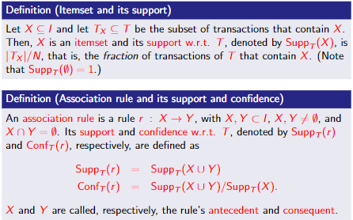
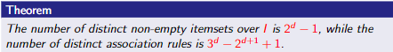
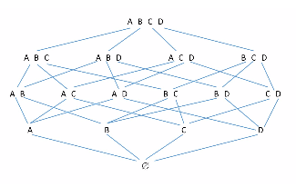
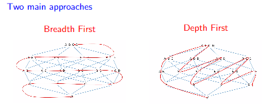
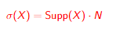
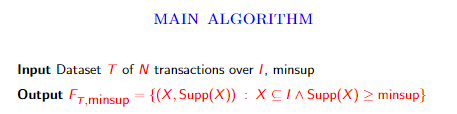
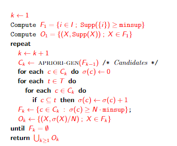
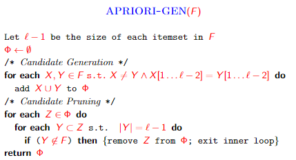

# Association Analysis

## Market-basket analysis

### Data

* A large set of __items__: e.g., products sold in a supermarket
* A large set of __baskets__: e.g., each basket represents what a customer bought in one visit to the supermarket

### Goal

Analyze data to extract

* __Frequent itemsets__: subsets of items that occure together in a high number of baskets
* __Association rules__: correlation between subsets of items.

## Rigorous formulation of the problem

Dataset T = {t_1,t_2,...,t_N} of _N_ transaction (i.e. baskets) over a set _I_ of _d_ items, with t_i subset of _I_, for 1<=_i_<=_N_

Given the dataset _T_ of _N_ transactions over _I_, and given a support threshold minsup in (0,1], and a confidence threshold minconf in (0,1], The following two objectives can be pursued:

1. Compute all frequent itemsets, that is, the set of itemsets _X_ such that Supp_T(_X_)>=minsup. We denote this set F_{T,minsup}
2. Compute all association rules _r_ such that Supp_T(_r_)>=minsup and Conf_T(_r_)>=minconf.

__Observations__:

* __Support and confidence measure the interestingness__ of a pattern. In particular, the threshold _minsup_ and _minconf_ define which patterns must be regarded as __interesting__.
* Ideally, we would like that the support and confidence of the returned patterns be __unlikely to be seen in a random dataset__. However, what is a random dataset?
* The choice of minsup and minconf is crucial since it directly influences
  * __Output size__: low thresholds may yield too many patterns which become hard to exploit effectively
  * __False positive/negatives__: low thresholds may yield a lot of uninteresting patterns, while high thresholds may miss some interesting patterns

## Potential output explosion

Let _I_ be a set of _d_ items.

* Strategies that enumerate of all itemsets/rules in order to find the interesting ones are out of question een for ground sets _I_ of small size
* As a first approximation, we consider efficient strategies that require time/space polynomial in both the input and the output sizes.

## Lattice of Itemsets

* The family of itemsets under subset forms a __lattice__, namely a partially ordered set where for each two elements _X, Y_ there exists a unique least upper bound (_X union Y_) and a unique greater lower bound (_X intersect Y_)
* The lattice can be represented through the __Hasse diagram__

  

## Anti-monotonicity of Support

The support function for itemsets exhibits the following property, referred to as __anti-monotonicity__. For every _X, Y subset of I_

Immediate consequence. For a given support threshold, we have

1. _X_ is frequent => for all _W_ subset of _X_, _W_ is frequent
2. _X_ is not frequent => for all _W_ subset of _X_, _W_ is not frequent

This implies that, in the lattice, frequent itemsets form a sublattice closed downwards

## Efficient mining of _F.I._ and _A.R._

### Key objectives

* Careful exploration of the lattice of itemsets exploiting anti-monotonicity of support
* Time/space complexities polynomial in the input and output size

### Two phases

1. Compute the set _F_ of all frequent itemsets w.r.t. minsup
2. For each itemset _Z_ in _F_, compute all rules _r : X->Y_ with _X union Y = Z_ and confidence at least minconf.

__Observation__: Phase 1 is, usually, the most demanding, computationally

### F.I. mining: A-Priori algorithm

Uses the breadth-first approach

For every itemset _X subset of I_, define its absolute support

__Observations__:

1. Candidate generation ensures that no itemset is generated twice
2. Candidate pruning removes itemsets that can be deemed apriori as not being frequent. This explains the name of the algorithm