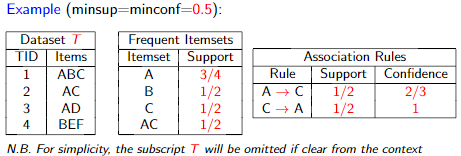
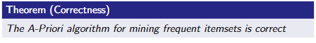

# Association Analysis

## Market-basket analysis

### Data

* A large set of __items__: e.g., products sold in a supermarket
* A large set of __baskets__: e.g., each basket represents what a customer bought in one visit to the supermarket

### Goal

Analyze data to extract

* __Frequent itemsets__: subsets of items that occure together in a high number of baskets
* __Association rules__: correlation between subsets of items.

## Rigorous formulation of the problem

Dataset T = {t_1,t_2,...,t_N} of _N_ transaction (i.e. baskets) over a set _I_ of _d_ items, with t_i subset of _I_, for 1<=_i_<=_N_

Given the dataset _T_ of _N_ transactions over _I_, and given a support threshold minsup in (0,1], and a confidence threshold minconf in (0,1], The following two objectives can be pursued:

1. Compute all frequent itemsets, that is, the set of itemsets _X_ such that Supp_T(_X_)>=minsup. We denote this set F_{T,minsup}
2. Compute all association rules _r_ such that Supp_T(_r_)>=minsup and Conf_T(_r_)>=minconf.

__Observations__:

* __Support and confidence measure the interestingness__ of a pattern. In particular, the threshold _minsup_ and _minconf_ define which patterns must be regarded as __interesting__.
* Ideally, we would like that the support and confidence of the returned patterns be __unlikely to be seen in a random dataset__. However, what is a random dataset?
* The choice of minsup and minconf is crucial since it directly influences
  * __Output size__: low thresholds may yield too many patterns which become hard to exploit effectively
  * __False positive/negatives__: low thresholds may yield a lot of uninteresting patterns, while high thresholds may miss some interesting patterns

## Potential output explosion

Let _I_ be a set of _d_ items.

* Strategies that enumerate of all itemsets/rules in order to find the interesting ones are out of question een for ground sets _I_ of small size
* As a first approximation, we consider efficient strategies that require time/space polynomial in both the input and the output sizes.

## Lattice of Itemsets

* The family of itemsets under subset forms a __lattice__, namely a partially ordered set where for each two elements _X, Y_ there exists a unique least upper bound (_X union Y_) and a unique greater lower bound (_X intersect Y_)
* The lattice can be represented through the __Hasse diagram__

  

## Anti-monotonicity of Support

The support function for itemsets exhibits the following property, referred to as __anti-monotonicity__. For every _X, Y subset of I_

Immediate consequence. For a given support threshold, we have

1. _X_ is frequent => for all _W_ subset of _X_, _W_ is frequent
2. _X_ is not frequent => for all _W_ subset of _X_, _W_ is not frequent

This implies that, in the lattice, frequent itemsets form a sublattice closed downwards

## Efficient mining of _F.I._ and _A.R._

### Key objectives

* Careful exploration of the lattice of itemsets exploiting anti-monotonicity of support
* Time/space complexities polynomial in the input and output size

### Two phases

1. Compute the set _F_ of all frequent itemsets w.r.t. minsup
2. For each itemset _Z_ in _F_, compute all rules _r : X->Y_ with _X union Y = Z_ and confidence at least minconf.

__Observation__: Phase 1 is, usually, the most demanding, computationally

### F.I. mining: A-Priori algorithm

Uses the breadth-first approach

For every itemset _X subset of I_, define its absolute support

__Observations__:

1. Candidate generation ensures that no itemset is generated twice
2. Candidate pruning removes itemsets that can be deemed apriori as not being frequent. This explains the name of the algorithm

### Correctness of A-priori

We assume the existence of a total odering of the items, and assume the transaction/itemsets are represented as sorted vectors

### Efficiency of A-priori

A-priori owes its popularity to a number of features that yield efficient running times especially when there aren't many frequent itemsets

* A few passes over the dataset are needed: namely k_{max} +1 passes, where k_{max} is the length of the longest frequent itemset. Note that if the number of frequent itemsets is small, k_{max} must also be small
* Exploiting the antimonotonicity of support, candidate generation and pruning ensure that only a few non-frequent itemsets are ever considered and their support computed
* Computing the supports of the candidates, usually the most time-consuming step, can be optimized is many ways

### Optimizations of A-priori: frequent pairs

* The support counting for the candidates in C_k, for k >= 2, is typically the most time-consuming step because:
  1. requires a pass over the entire dataset
  2. may use much space
* In practice, the issue of space may become critical for C_2, which contains all pairs of frequent items. As _k_ grows larger, the cardinality of F_{k-1}, hence of C_k drops

#### GOAL

Compute F_1 efficiently and, at the same time, gather statistics for filtering out infrequent pairs. Consider an istancewith _N_ transactions, _d_ items, and threshold minsup

* Let _h_ be a hash function that maps pairs of items to integers in [0,_K-1_], for a suitable value _K_
* Use _d + K_ counters: one counter γ_i for each _i in I_ and a counter δ_j, for every 0<=_j_<=_K_. Counters are initialized to 0.
* For every transaction _t_ do
  * For each item _i in t_, increment γ_i
  * For each pair of items _i_1,i_2 in t_ increment δ_{h(i_1,i_2)}
* __Key remark__: only pairs of items _i_1,i_2_ such that δ_{h(i_1,i_2)} >= N\*minsup have a chance to be frequent
* Compute F_1 = {_i in I : γ_i >= N\*minsup_}
* Compute C_2 as the set of pairs _i_1,i_2_ such that:

  

__Observations__:

* THe first condition yields the same set of candidates as APRIORI-GEN, while the second condition aims at filtering out some of these candidates
* if _K_ is chosen sufficiently large, hence many pair counters are used, then filtering out of infrequent pairs become quite effective

### Other optimizations

A large body of litterature has investigated several additional strategies to optimize the mining of frequent itemsets.

* A data structure trie-like was defined by the original developers of A-priori, to be used for storing the set of candidates C_k so to speed up their support counting. In essence, for each transaction, the hash tree quickly provides a subset of the candidates to be checked for inclusion
* Several implementations of depth-first mining strategies have been devised and tested. Their goal is to avoid several passes over the entire dataset of transactions, which may be huge, and to confine the supportcounting of longer itemsets to suitable projections of the dataset, typically much smaller than the original one.

### Mining association rules

* Once the frequent itemsets and their supports have been computed all association rules which are based ont these itemsets and satisfy the given confidence requirement can be determined
* Let minconf be the given confidence threshold. For each frequent itemset _Z_, we must determine the set:

  
* Note that each rule in the above set has the same support as _Z_, hence it automatically satisfies the support constraints since _Z_ is frequent. Conversely, rules derived from itemsets which are not frequent need not to be checked, since they would not satisfy the support constraint
* Checking all non-empty subsets _Y subset Z_ as RHS of possible rules with confidence at least minconf may be too costly. We exploit a sort of anti-monotonicity properly for rules, as we did for frequent itemsets.
* Anti-monotonicity property for rules. For _emptyset != Y' subset Y subset Z_ we have

  
* Immediate consequence

  

  Thus for each itemset _Z_ it is convenient to check rules with RHS of progressively increasing size2

### Algorithm for mining association rules

Let _O_ = set of frequent itemset and their supports

#### Efficiency of the A.R. algorithm

* The algorithm does not require access to the dataset _T_ but only to the frequent itemsets and their supports. If the frequent itemsets are not too many, as one qould hope when the support threshold is properly chosen, avoiding the access to _T_ may yield substantial performance gains.
* The use of APRIORI-GEN avoids that for any frequent itemset the confidence of an extremely large number of rules be checked
* It can be easily shown that the algorithm can be implemented in time polynomial in both the input size and output size

## Frequent itemsets mining for big data

When the dataset _T_ is very large one can follow two approaches

1. __Partition-based approach__: avoid multiple passes over the dataset by __partitioning _T_ into subsets__, mining frequent itemsets independently in each subset, and combining the results
2. __Sampling approach__: compute the frequent itemsets from a small sample of _T_ and show that they provide a _suitable approximation_ to the exact set.

### Partition-based approach

1. Partition _T_ arbitrarily into _K_ subsets of _O(N/K) transactions each, and compute the set of frequent itemsets with regard to minsup independently in each subset
2. Gather al frequent itemsets computed in round 1 and eliminate duplicates. Call Φ the resulting set of itemsets
3. For every 0 < j < _K_ independently do the following:

  gather a copy of Φ and _T_j_ and compute, for each _X in Φ_, the number of transactions of _T_j_ that contain _X_ and call it _σ(X,j)_
4. For each _X in Φ_, gather all _σ(X,j)_, compute the final support and output _X_ if Supp(X)>=minsup

### Partition-based approach: analysis

* __Correctness__: it follows from the fact that each itemset frequent in _T_ must be frequent in some _T_j_. In other words, Φ contains all final frequent itemsets, although it may contain many more
* __Number of rounds__: 4
* __Space requirements__: they mainly depend on the size of Φ, which cannot be easily predictedm and the algorithm used to extract the frequent itemsets in the first round

__Remark__: while the algorithm may work well in practice, it does not feature strong theoretical guarantees

### Sampling-based approach

* Condition (1) ensures that the approximate set C comprises all true frequent itemsets
* Condition (2) ensures that: (a) C does not contain intemsets of very low support; and (b) for each itemset _X_ such that _(X,s_X) in C, s_X_ is a good estimate of its support.

Let _T_ be a dataset of _N_ transactions over _I_, and minsup in (0,1] a support threshold. Let also θ(minsup) < minsup be a suitably lower support threshold

* Let _S subset T_ be a sample drawn at random with replacement with uniform probability and with replacement
* Return the set of pairs

  

  where F_{S,θ(minsup)} is the set of frequent itemsets with regard to _S_ and θ(minsup)

### VC-dimension

#### Analysis of sampling-based approach

A dataset _T_ of transactions over _I_ can be seen as a range space (D,R):

* _D = T_
* _R = {T_X: X subset I and X != emptyset}_, where _T_X_ is the set of transactions that contain _X_

It can be shown that the VC-dimension of (D,R) is <= _h_, where _h_ is the maximum transaction length

__Observations__:

* The size of the sample is independent of the support threshold minsup and of the number _N_ of transactions. It only depends on the apporximation guarantee embodied in the parameters ε, δ, and on the max transaction length _h_, which is often quite low.
* There are bounds on the VC-dimension tighter than _h_
* The sample-based algorithm yields a 2-round MapReduce algorithm:

  in first round the sample of suitable size is extracted;

  in the second round the approximate set of frequent itemsets is extracted from the sample within one reducer