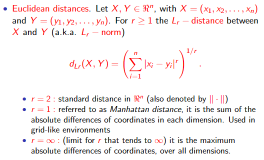
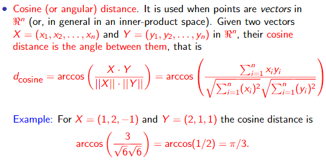
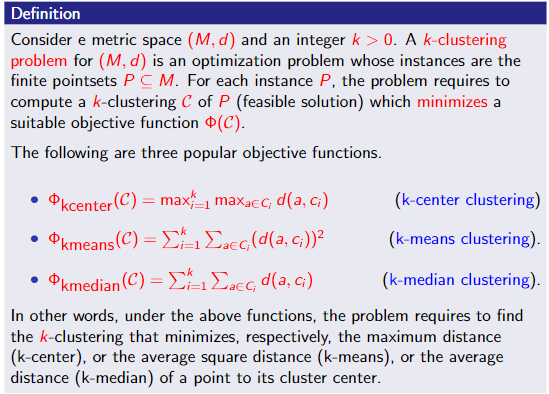
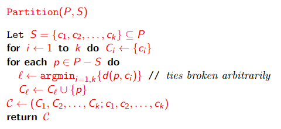
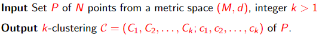
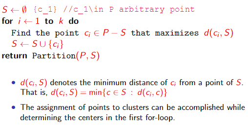

# Clustering

## General definition

Given a __set of points__ belonging to some __space__, with a notion of __distance__ between points, __clustering__ aims at grouping the points into a number of subsets (___clusters___) such that

* points in the same cluster are “close” to one another
* points in different clusters are “distant” from one another

THe distance captures a notion of similarity: close points are similar, distant points are dissimilar

A __clustering problem__ is usually defined by requiring that clusters optimize a given __objective function__, and/or satisfy certain __properties__. Numerous clustering problems have been defined, studied and employed in applications over the years.

## Metric Space

Typically, the input of a clustering problem consists of a set of points from a __metric space__

### Definition

A __metric space__ is an ordered pair (M, d) where M is a set and d(.) is a metric on M, i.e., a function

    d: M \* M->R

such that for every x, y, z in M the following rules holds

* d(x, y) >= 0
* d(x, y) = 0 iff x = y
* d(x, y) = d(y, x) (symmetry)
* d(x, z)<=d(x, y) + d(y, z) (triangle inequality)

## Distance functions

### Euclidean distances

### Jaccard distance

Used when points are sets. Let S and T be two sets over the same ground set of elements. The Jaccard distance between S and T is defined as

Note that the distance ranges in [0,1], and it is 0 iff S = T and 1 iff S and T are disjoint. The fraction in the Jaccard distance is referred to as the _Jaccard similarity_ of the two sets

### Cosine (or angular) distance

__Remark__. The cosine distance is often used in information retrieval to assess similarity documents. Consider an alphabet of _n_ words. A document X over the alphabet can be represented as an _n_-vector, where _xi_ is the number of occurrences in X of the _i_-th word of the alphabet

* For non-negative coordinates it takes values in [0,π/2], while for arbitrary coordinates the range is [0,π]. Dividing by π/2 (or π) the range becomes [0,1]
* In order to satisfy the second property of distance functions for metric spaces, scalar multiplesof a vector must be regarded as the same vector

### Edit distance

Used for strings. Given two strings X and Y, their edit distance is the __minimum number of deletion and insertion__ that must be applied to transform X in Y

It is immediate to show that in all cases the edit distance is

|X|+|Y|-2|LCS(X, Y)|

### Hamming distance

Used when points are vectors over some _n_-dimensional space. Most commonly, it is used for binary vectors. The Hamming distance between two vectors is __the number of coordinates in which they differ__.

## Curse of dimensionality

Random points in high-dimensional metric space tend to be

* sparse
* almost equally distant from one another
* almost orthogonal (as vectors) to one another

As a consequence, in high dimensions distance functions may lose effectiveness in assessing similarity/dissimilarity. However, this holds in particular when points are random, and it might be less a problem in some real-world datasets.

As an example, consider a set S of N random points in [0,1]^t, where for each point the i-th coordinate is a random number in [0,1] drawn with uniform probability indipendently of the other coordinates and of the other points.

## Types of clustering

Given a set of points in a metric space, hence a distance between points, a clustering problem often specifies and __objective function__ to optimize. The objective function also allows comparing different solutions.

Objective functions can be categorized based on wether or not

* a target number _k_ of clusters is given in input
* for each cluster a _center_ must be identified

  When centers are required, the value of the objective function depends on the selected centers. Cluster centers must belong to the underlying metric space but, sometimes, they are costrained to belong to the input set.
* _Disjoint clusters_ are sought

### Center-based clustering

Let P be a set of N points in a metric space (M, d), and _k_ be the target number of clusters, 1 <= _k_ <= N. We define a ___k_-clustering of P__ as a tuple C = (C1,..., C _k_;c1,..., c _k_) where

Observe that the above definition requires the center to belong to the clusters, hence to the pointset. Whenever appropriate, we will discuss the case when the center can be chose more freely from the metric space.

* All aforementioned problems (k-center, k-means, k-median) are __NP-hard__. Hence, in general it is impractical to search for optimal solutions.
* There are severa efficient approximation algorithms that in practice return good-quality solutions. However, dealing efficiently with large inputs is still a challenge.
* K-center and k-median belong to the family of __facility-location-problems__. In these problems, a set F of candidate facilities and a set C of clients are given and the objective is to find a subset of at most _k_ candidate facilities to open, and an assignment of clients to them, so to minimize the maximum of average distance between a client and its assigned facilities. In our formulation, each input point represents both a facility and a client. Numerous variants of these problems have been studied in the literature.
* K-means objective is also referred to as __Sum of Squared Errors (SSE)__

### Partitioning primitive

Let P be a pointset and S subset of P a set of _k_ selected centers. For all previously defined clustering problems, the best _k_-clustering around these centers is the one where each ci belongs to a distinct cluster and each other point is assigned to the cluster of the closest ci (ties broken arbitrarily)

## k-center clustering

### Farthest-First Traversal: algorithm

* K-center clustering provides a strong guarantee on how close each point is to the center of its cluster.
* However, gor noisy pointsets (e.g. pointsets with outliers) the clustering which optimizes the _k_-center objective may obfuscate some “natural” clustering inherent in the data
* For any fixed ε > 0 it is NP-hard to compute a _k_-clustering C_alg with

  

  hence, the Farthest-First Traversal is likely to provide almost the best approximation guarantee obtainable in polynomial time

### k-center clustering for big data

How can we compute a “good” k-center clustering of a pointset P that is too large for a single machine?

We employ a __coreset-based approach__:

1. Extract from P a small T (coreset) of representatives
2. Compute within T the set S of _k_ cluster centers
3. Compute the final clustering around the center of S

#### Observations

* The coreset-based approach is effective when step 1 and 3 can be performed efficiently, and the coreset T contains a good set of centers
* Coreset are used to confine computations which are too expensive to run on the whole input on small instances
* A coreset needs not to be a simple subset of the input

### MapReduce-Farthest-First Traversal

Let P be a set of N points (N large) from a metric space (M, d), and let _k_ > 1 be an integer. The following MapReduce algorithm computes a good _k_-center clustering.

1. Partition P arbitrarily in _l_ subsets of equal size and execute the Farthest-First Traversal algorithm on each subset separately to identify a set T_i of _k_ centers.
2. Gather the coreset T = union of all T_i and run using a single reducer, the Farthest-First Traversal algorithm on T to identify S = {c1,..., c _k_} of _k_ centers
3. [Execute Partition(P, S)](#Partitioning-primitive)

#### Observation

Note that in rounds 1 and 2 the Farthest-First traversal algorithm is used to determine only centers and not complete clusterings.

#### Analysis of MR-Farthest-First Traversal

Assume _k_=o(N). By settings _l_ = (N/_k_)^1/2, it is easy to see that the 3-round MR-Farthest-First traversal algorithm uses

#### Observations on MR-Farthest-First Traversal

* The sequential Farthest-First Traversal algorithm is used both to extract the coreset and to compute the final set of centers. It provides a good coreset since it ensures that any point not in the coreset be well represented by some coreset point.
* The main feature of MR-Farthest-First Traversal is that while only small subsets of the input are processed at once, and many of them in parallel, the final approximation is not too far from the best achievable one.
* By selecting _k'_ > _k_ centers from each subset Pi in round 1, the quality of the final clustering improves. In fact, it can be shown that when P satisfy certain properties and _k'_ is sufficiently large, MR-Farthest-First Traversal returns a (2+ε)-approximation for any constant ε > 0, still using sublinear local space and linear aggregate space.