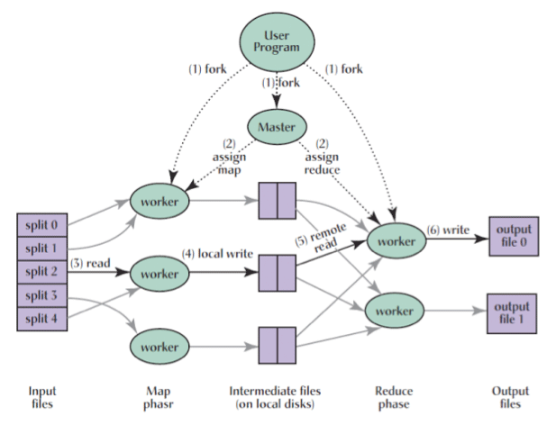

# MapReduce
## Big data challenges
* Computational complexity
    * Any processing requiring a __superlinear number of operations__ may easily turn out __unfeasible__ (_e.g. O(n3) with big datas_)
    * If input size is really huge, just __touching all data items__ is already time consuming
    * For computation-intensive algorithms, exact solutions may be too costly. __Accurancy-efficiency tradeoffs__ (_give up accurancy for better efficiency_)
* Effective use of parallel/distributed platforms:
    * Sepcialized high-performance architectures are costly and become rapidly obsolete
    * Fault-tollerance becomes serius issue: __low Mean-Time Between Failures__ (_MTBF_)
    * Parallel/distributed programming requires __high skills__
## MapReduce
* Introduced by Google 2004
* Programming framework for handling big data
* Employed in __many application scenarios__ on __clusters of commodity processors__ and __cloud infrastructures__
* Main features:
    * Data centric view
    * Inspired by functional programming (_map, reduce functions_)
    * Ease of programming. Messy details are hidden to the programmer
* Main implementation: __Apache Hadoop__
    * extremely slow
    * High inefficiency
* Hadoop ecosystem: several variant and extensions aimed at improving Hadoop's performance (_e.g. Apache Spark_)
## Typical cluster architecture
* Racks of 16-64 __compute-nodes__ connected by fast switches
* Distributed File System
    * Files divided into chunks
    * Each chunk repicated with replicas in different nodes and, possibly, in different racks
    * The distribution of the chunks of a file is represented into a master node file wichi is also replicated. A directory records where all master nodes are
## MapReduce computation
* Computation viewed as a __sequence of rounds__.
* Each round transforms a set of __key-value pairs__ into another set of __key-value pairs__ (_data centric view!_) through the following phases
    * Map phase: a user specified __map-function__ is applied separately to each input key-value pair and procudes other key-value pairs referred as __intermediate key-value pairs__
    * Reduce phase: the __intermediate key-value pairs__ are __grouped by key__ and a user-specified __reduce function__ is applied separately to each group of key-value pairs with the same key, producing other key-value pairs which is the output of the round

## MapReduce Round

* Starts and ends in HDFS (_Hadoop Distributed File System)
* Data are split in chunks
* Workers are actual machines
* local disks for intermediate files are the memory of the workers

## Dealing with faults

* The Distributed File System is fault-tolerant
* Master pings workers periodically to detect failures
* Worker failure:
    * Map tasks completed or in-progress at failed worker are reset to idle and will be rescheduled. Note that even if a map task is completed, the failure of the worker makes its output unavailable to reduce tasks, hence it must be rescheduled.
    * Reduce tasks in-progress at failed worker are reset to idle and will be rescheduled.
* Master failure: the whole MapReduce task is aborted
## Specification of a MapReduce (MR) algorithm

1. Specify what the input and the output are
2. Make clear the sequence of rounds
3. For each round
    * input intermediate and output key-value pairs need to be clear
    * functions in the map and reduce phases need to be clear
4. Enable analysis
## Key performance indicators
1. Number of rounds
2. Local space ML: maximum amount of space required by any map or reduce function executed by the algorithm for storing input and temporary data (_but not the output since it will be stored in the local disk or in the HDFS depending on the step of the mapReduce_)
3. Aggregate space MA: maximum amount of space which, at any time during the execution of the algorithm, is needed to store all data required at that time or at future times
### Observation
* The indicators are usually estimated through asymptotic analysis as functions of the instance parameters (_e.g. imput size_). The analysis could be worst-case (_algorithmic-like_) or probabilistic.

* In general, the number of rounds R depends on the instance, on ML, and on MA. Typically, the larger ML and MA, the smaller R.

## Design goals for MapReduce algorithms

__Theorem__

For every computational problem solvable sequentially with space complexity __S(|input|)__ there exists a 1-round MapReduce algorithm with ML = MA = Θ (S(|input|))

* For efficiency, the design of an MR algorithm should aim at:
    * few rounds
    * Sublinear local space
    * Linear aggregate space, or only slightly superlinear
    * Polynomial complexity of each map or reduce function

# Basic primitives and tecniques

## Word Count

1. __Input__: collection of text documents containing N words overall. Each document is a key-value pair, whose key is the document's nae and the value is its content.
2. __Output__: The set of pairs __(w,c(w))__ where __w__ is a word occurring in the documents, and __c(w)__ is the number of occurrences of __w__ in the documents.

__Round 1__

* Map phase: for each document produce the set of intermediate pairs __(w,1)__, one for each occurence of a word __w__ N.B.: the wordk is the key of the pair.
* Reduce phase: for each word __w__, gather all intermediate pairs __(w,1)__ and produce the pair __(w,c(w))__ by summing all values of the pair.

### worst-case analysis

respect to the input size N

* R = 1
* ML = O(N). Bad case: only one word occurs repeated N times over all documents
* MA = O(N).

__Observation__: The algorithm does not satisfy the aforementioned design goals: in particular, it does not attain sublinear local space

## Improved word count

For each document the map function produces ine pair for each word with the number of occurrences of said word in the document.

Let Ni be the number ov words in Di. The optimization yields:
* R = 1
* ML = O(maxi=1,kNi+k)
* MA = O(N)

__Observation__:
* The sublinear local space requirement is satisfied as long as Ni = o(N) for each i, and k = o(N)
* by treating each document as an individual key-value pair we have that for any algorithm ML= Ω (maxi=1,kNi). Implies that only the O(k) additive term can be removed

__Partitioning Technique__:

When some aggregation functions may potentially receive large inputs (_e.g. large k_) or skewed ones it is advisable to partition the input, either deterministically or randomly, and perform aggregation in stages.

This can be done with:

* An improved version of word count
* A general category counting primitive

### Improved Word count 2

__Idea__: partition intermediate pairs in o(N) groups and compute counts in two stages

#### Round 1:

__SLIDES__

#### Round 2:

__SLIDES__

## Category Counting

__SLIDES__

## Maximum Pairwise Distance

__SLIDES__

### Exercise

__QUADERNO__

#### Round 1

#### Round 2

#### Round 3

#### Round 4

#### Round 5